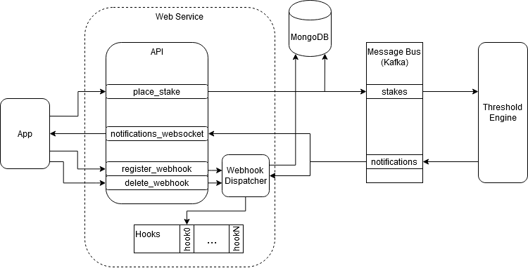

# Challenge Sportsbook (2019)
A code challenge for a certain company

## Objective
Build a service that:
 * allows players to place bets
 * flag players who place stakes above a configurable threshold, within a certain time frame (non-overlapping time windows)
 * when a player crosses a threshold a notification must be generated
 * notifications must be:
    * persisted in a sql or nosql layer
    * available via websocket
 * must be easily deployable

## Architecture


The image above shows the system architecture built for the sake of this exercise, it includes:
* Web service (Spring REST API):
    * stakes placement
    * threshold notifications webhook dispatcher
    * threshold notifications websocket
    * mongoDB persistence layer for both stakes and threshold notifications
* App (HTML + javascript):
    * web page connected to the notification websocket which displays threshold notifications in real-time
* Threshold engine (Kafka Streams):
    * real-time threshold engine
    * configurable threshold limit and window size ([based on java.time.Duration.parse()](https://docs.oracle.com/javase/8/docs/api/java/time/Duration.html#parse-java.lang.CharSequence-))
* Messaging Bus (Kafka):
    * links the web service and the threshold engine 

Additionally, the system is fully containerized and deployable using docker-compose.

## Running it

### Requirements
* building
    * maven
    * jdk >= 11
* deploying
    * docker
    * docker-compose

### Build
```bash
mvn clean package
```

### Deploy
```bash
docker-compose up -d
```

### Notifications Webpage
```
localhost:8080/index.html
```

## Using it
The logic behind the service is pretty straight forward, places from different players come in, if a player crossed the defined threshold, a notification is generated into the message bus and, consequently to the websocket and all webhooks registered.

Below are the REST API interactions for placing bets and registering/deleting web hooks.

### Place stakes
```bash
curl --location --request POST 'localhost:8080/stakes/placeStake' \
--header 'Content-Type: application/json' \
--data-raw '{
	"account": "Alice",
	"stake": 55
}'
```

### Register notifications webhook
```bash
curl --location --request POST 'localhost:8080/notifications/registerWebhook' \
--header 'Content-Type: application/json' \
--data-raw '{
	"url": "https://some.webhook.endpoint"
}'
```

### Delete a webhook
```bash 
curl --location --request PUT 'localhost:8080/notifications/deleteWebHook/02170326-71d4-4734-a5a9-bd03ab790d31'
```

### Websocket
The socket is available at http://localhost:8080/topic/notifications